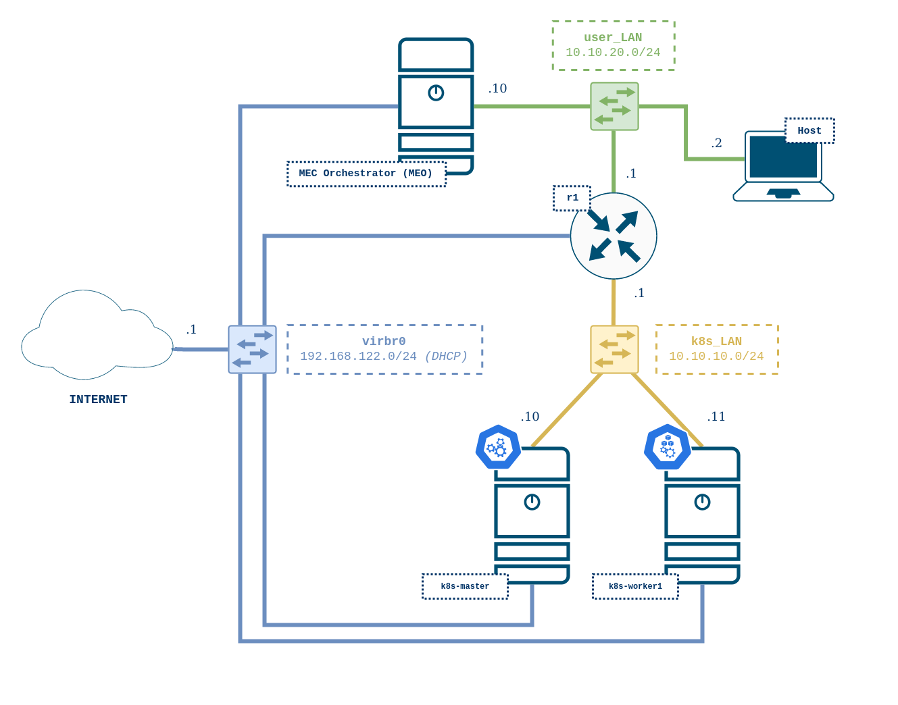

# vnx-mec-k8s

VNX scenario that deploys a cloud native-oriented MEC platform which is aligned with ETSI ISG MEC reference architecture. The scenario simulates a MEC Host that leverages Kubernetes as its Virtualization Infrastructure Manager(VIM). Additionally, Kubernetes fulfills MEPM functionalities by utilizing our proposed ETSI-compliant mechanism based on Helm for MEC Application package management and life-cycle management.

The MEC Host nodes are attached to a router that provides connectivity to the MEC Orchestrator (MEO). User's host machine is connected to the same network, thus enabling users to play the role of OSS interacting with the MEO and the MEPM.

For the sake of simplicity, the Kubernetes cluster is composed of a master and a worker node. Only the worker node is scheduled for instantiating workloads, leaving the master node just for control plane and system services. It is left for future works expanding the cluster to two or more worker nodes in order to benefit from the HA capabilites that Kubernetes offers.

## Scenario topology



K8s nodes are deployed as KVM virtual machines that run Ubuntu LTS 18.04 image. Components router `r1` and the MEC orchestrator (MEO) are deployed as LXC containers which also run Ubuntu LTS 18.04.

## Requirements

**IMPORTANT NOTE:** This VNX scenario **cannot be deployed on a VirtualBox VM** since some of the virtualized nodes in the scenario are KVM-based virtual machines.

- Baremetal Linux OS (_Tested with Ubuntu LTS 18.04_)
- VNX software -> [VNX Installation Recipe](https://web.dit.upm.es/vnxwiki/index.php/Vnx-install)
- Internet connection
- Hardware requirements: minimum 4GB RAM and 4 CPU cores

## Setup

This scenario relies on the Kubespray project to install Kubernetes. Kubespray is a collection of Ansible playbooks that provides an easy and complete interface for deploying production-grade Kubernetes clusters.


Kubespray requires Ansible among other utilities to work. Install them with pip by leveraging its requirements file as follows:

```bash
cd mec_k8s/ansible/kubespray
sudo pip3 install -r requirements.txt
```

## Getting Started

First of all deploy VNX scenario:

```bash
cd mec_k8s
sudo vnx -f mec_k8s.xml -v --create
```

You can close all terminal windows that may appear as every node can also be accessed via SSH later on. Upon creating a VNX scenario, VNX will automatically generate an SSH configuration file for an easy access to all the nodes by simply using their names. In this scenario the following recipe shows how to access each node:

```bash
# K8s master node
ssh k8s-master

# K8s worker node
ssh k8s-worker1

# Router
ssh r1

# MEC Orchestrator (MEO)
ssh meo
```

Once VNX has finished creating the virtual scenario, run the following Ansible playbook to setup a Kubernetes cluster on the MEC Host nodes:

```bash
cd mec_k8s/ansible
ansible-playbook site.yml
```

Please wait patiently, the execution of the Ansible playbook will take 10 minutes roughly. Once Ansible has finished successfully, the virtual scenario will be ready to play with.

## Cleanup

To destroy the VNX scenario run the following command:

```bash
cd mec_k8s
sudo vnx -f mec_k8s.xml -v --destroy
```

## References

- ETSI ISG MEC 003, "Multi-access Edge Computing (MEC); Framework and Reference Architecture", v2.1.1, 2019
- ETSI ISG MEC 010, "Multi-access Edge Computing (MEC);MEC Management; Part 2: Application lifecycle, rules and requirements management", v2.1.1, 2019
- [Kubespray](https://github.com/kubernetes-sigs/kubespray)
- [FastAPI](https://fastapi.tiangolo.com/)
- [Bird](https://bird.network.cz/)
- [MetalLB](https://metallb.universe.tf/)
